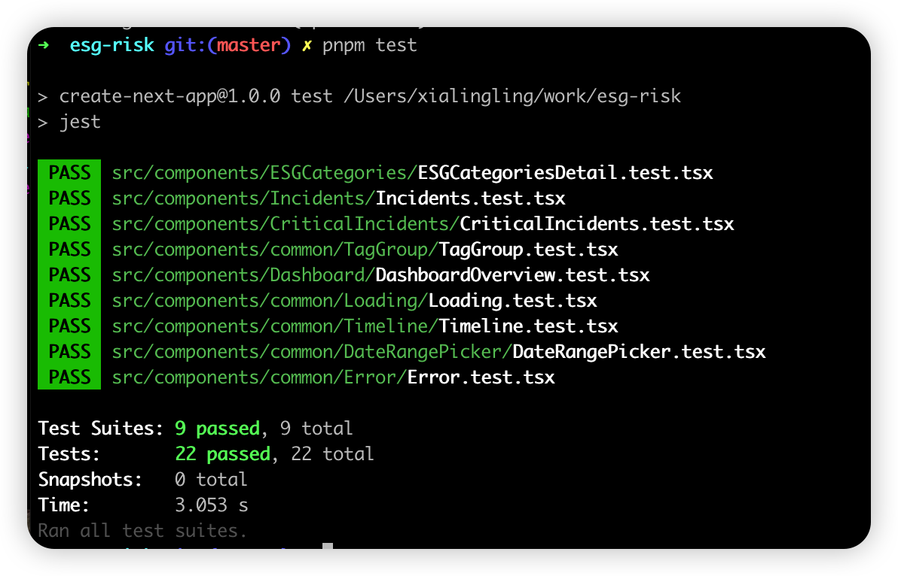

运用了 nvm 来切换 node 的版本，如果没有 nvm 配置，直接使用 18.20.4 的 node 版本

markdown:/Users/xialingling/work/esg-risk/README.md### 本地开发启动

```
npm start


```

### 运行测试

```bash
pnpm test
# 或
npm run test
```

### 构建生产环境

```bash
pnpm build
# 或
npm run build
```

---

## 2. Component Architecture Overview

项目采用模块化组件架构，主要结构如下：

```

src/
  components/
    Dashboard/           # 仪表盘相关组件
    RiskScore/           # 风险分数展示组件
    ESGCategories/       # ESG 类别详情组件
    Incidents/           # 事件时间轴与详情组件
    common/              # 通用组件（如 Loading、Error、TagGroup、Timeline 等）
  hooks/
    useQueries.ts        # 统一数据获取与缓存
  contexts/
    ThemeContext.tsx     # 主题上下文
  data/                  # 本地 mock 数据
  services/              # API 服务层
  types/                 #组建的ts类型文件
  pages/                 # Next.js 页面入口
```

- **高复用、低耦合**：每个业务模块有独立目录，通用组件集中在 `common` 目录。
- **类型安全**：全局使用 TypeScript，类型定义集中在 `types/` 目录。
- **样式管理**：采用 CSS Modules + SCSS，支持主题切换。

---

## 3. Key Design Decisions

- **Next.js 作为基础框架**：支持 SSR、静态生成和高性能路由。
- **Chakra UI**：提升开发效率，保证一致的设计风格和响应式体验。
- **React Query**：用于服务端数据获取、缓存和状态管理，简化异步逻辑。
- **模块化组件设计**：每个组件职责单一，便于维护和复用。
- **Mock 数据与真实 API 解耦**：开发阶段可切换本地数据与后端接口，提升开发效率。
- **严格的代码规范**：集成 ESLint、Prettier、Husky、lint-staged 保证代码质量。

---

## 4. State Management Approach

- **全局状态**：采用 React Context（如 ThemeContext）管理全局主题等状态。
- **服务端数据**：全部通过 React Query（useQuery/useMutation）管理，自动处理缓存、刷新、错误重试等。
- **本地 UI 状态**：组件内部使用 useState/useReducer 管理，保持状态局部化，避免全局污染。
- **类型定义**：所有状态和数据结构均有 TypeScript 类型约束，提升可维护性和开发体验。

---

## 5. Performance Considerations

- **数据缓存**：React Query 自动缓存和去重，减少重复请求。
- **懒加载与代码分割**：Next.js 支持页面级和组件级代码分割，提升首屏速度。
- **响应式设计**：Chakra UI 内置响应式工具，适配多终端。
- **避免不必要的渲染**：组件拆分合理，useMemo/useCallback 优化性能敏感区域。
- **图片与静态资源优化**：利用 Next.js 的静态资源优化能力。

---

## 6. 其他说明

- **测试覆盖**：使用 Jest + React Testing Library，覆盖核心组件和业务逻辑。
- 
- **文档完善**：详见 [COMPONENTS.md](./COMPONENTS.md) 了解所有组件用法与参数。
- **持续集成**：推荐结合 GitHub Actions/CI 工具自动化测试与部署。
